## Étape 1 : Création du projet

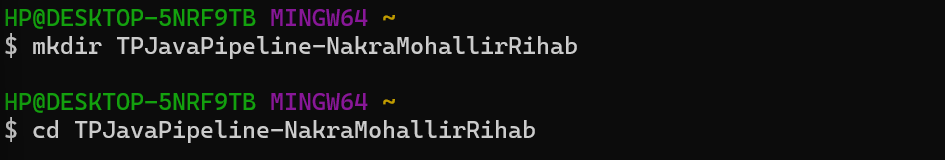

---

## Étape 2 : Génération du projet Maven

---

## Étape 3 : Initialisation du dépôt Git

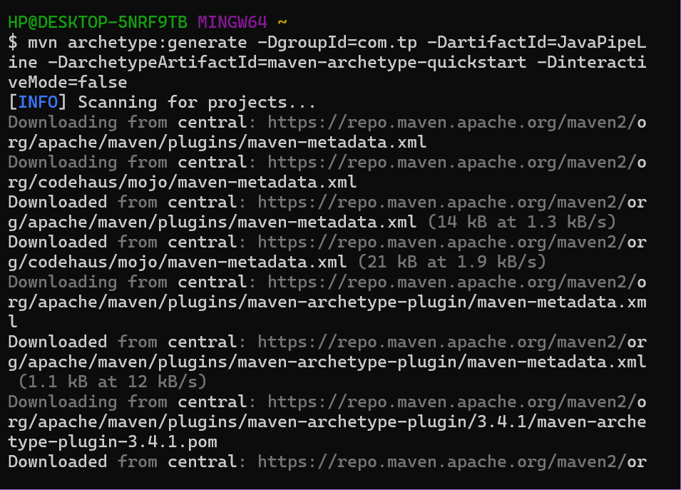

---

## Étape 4 : Configuration du .gitignore

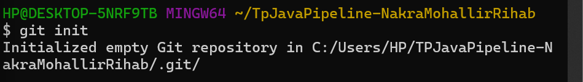

---

## Étape 5 : Premier commit

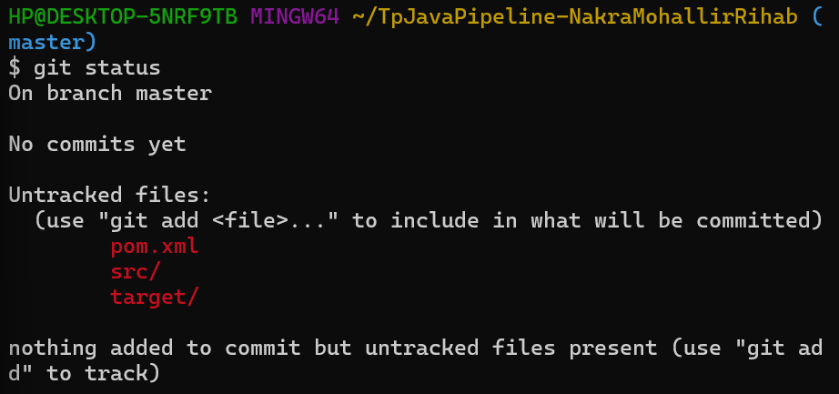

---

## Étape 6 : Lien avec GitHub

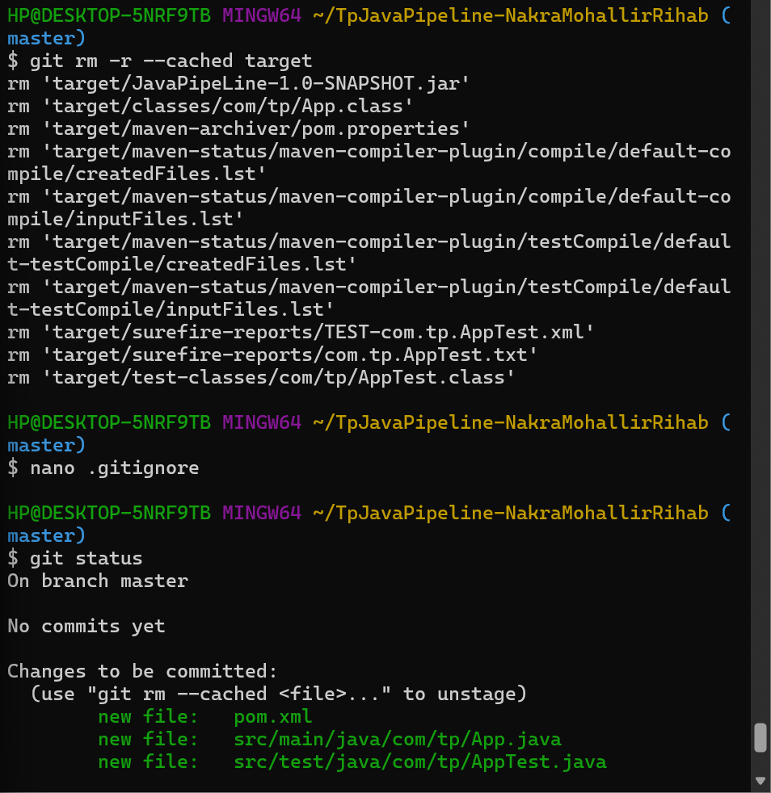

---

## Étape 7 : Création du pipeline Jenkins

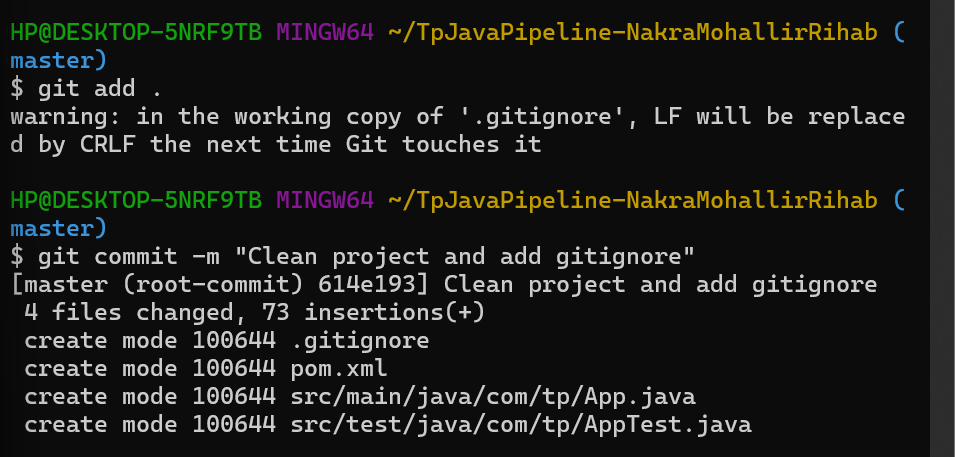

---

## Étape 8 : Création du Jenkinsfile

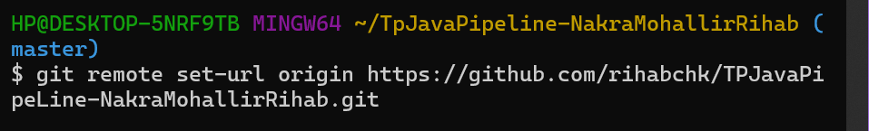

---

## Étape 9 : Structure du Jenkinsfile

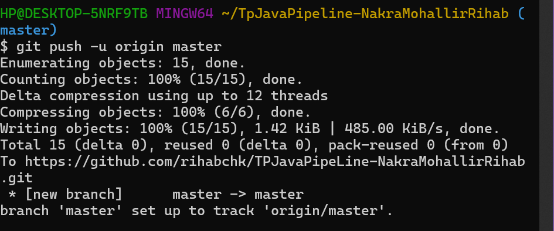

---

## Étape 10 : Push du Jenkinsfile

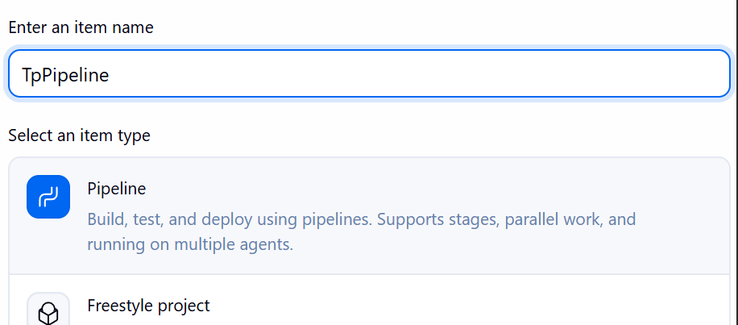

---

## Étape 11 : Configuration Jenkins (SCM)

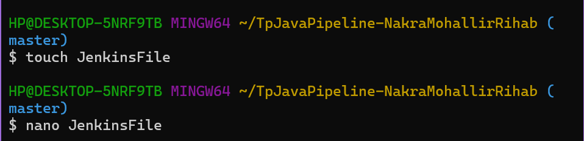

---

## Étape 12 : Exécution du pipeline

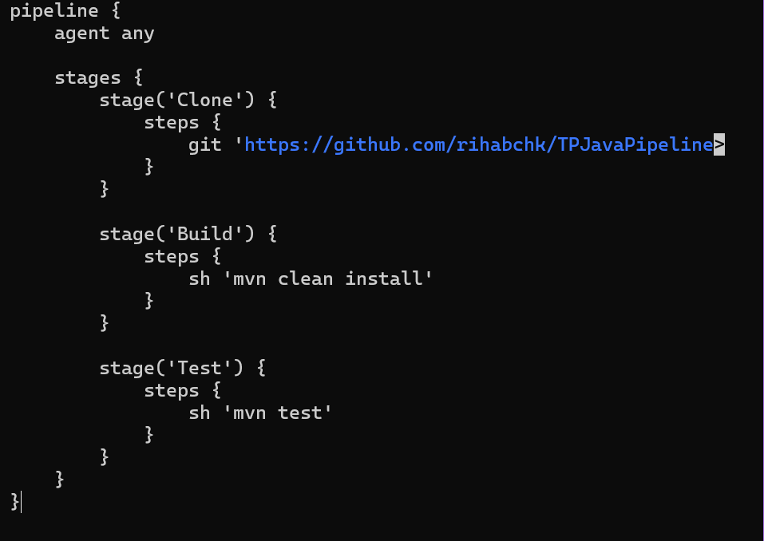

---

## Étape 13 : Problème du webhook

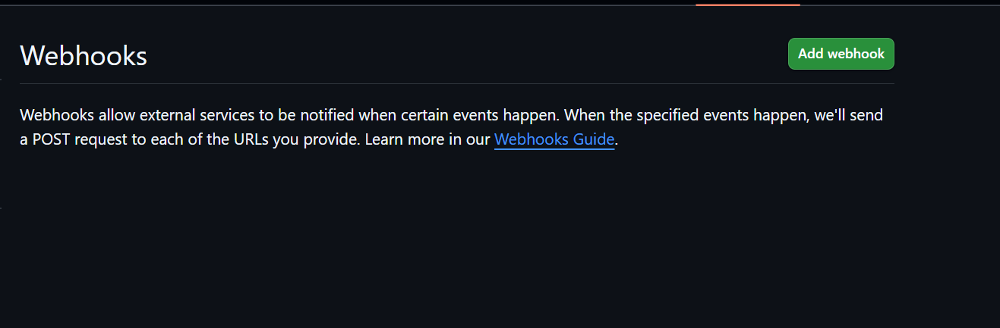

---

## Étape 14 : Utilisation de ngrok

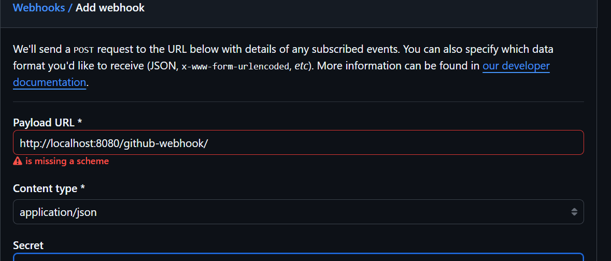

---

## Étape 15 : Webhook GitHub configuré

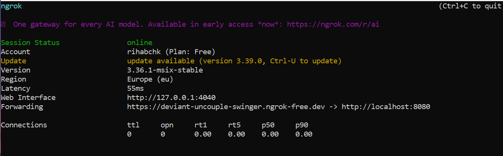

---

## Étape 16 : Activation du trigger Jenkins

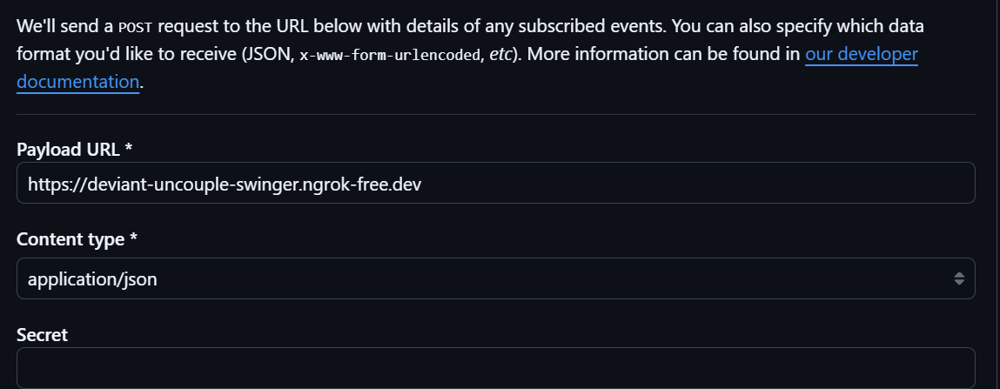

---

## Étape 17 : Test du webhook

---

## Étape 18 : Push test

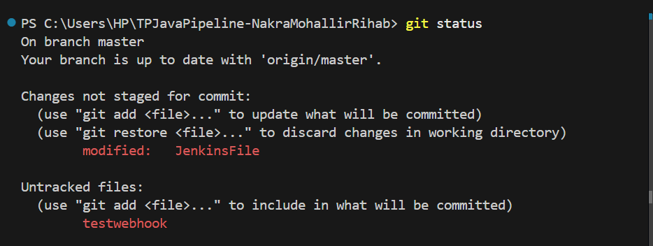

---

## Étape 19 : Déclenchement automatique

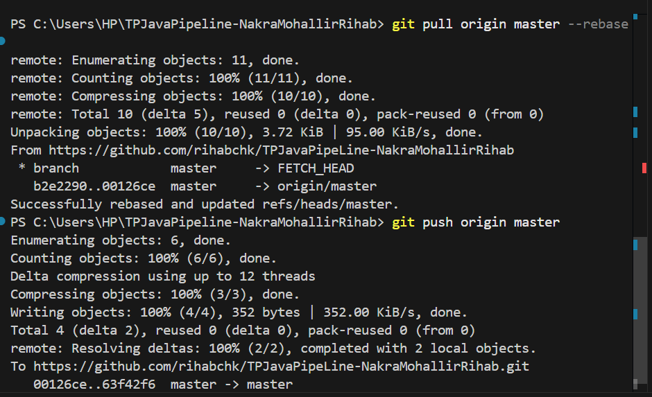

---

## Étape 20 : Vérification finale

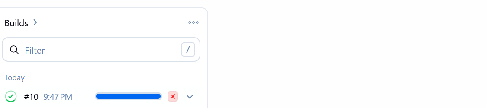

---
